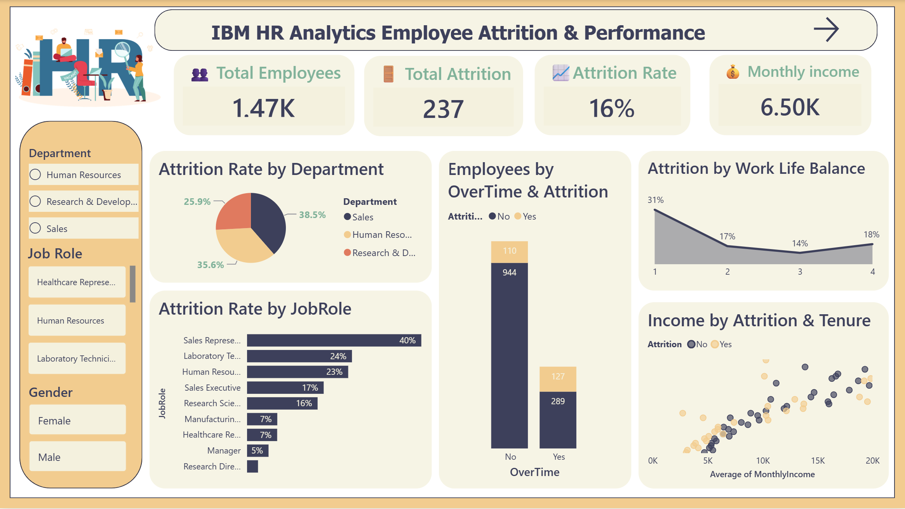

# -HR-Employee-Attrition-

 **📌Project Overview**
 
The dashboard helps HR teams answer key questions:

-What is the overall employee attrition rate?
-Which departments and job roles have the highest turnover?
-Does working overtime affect attrition?
-Does monthly income influence whether employees stay or leave?
-Does work-life balance affect attrition?
-Which age groups, marital statuses, and genders are most likely to leave?
-Does distance from home or years at the company make a difference?

---------------------------------------------------------------------------------------------------------------

**🔍Key Insights**

Calculated from the full dataset, with no filters applied.

📉 Overall attrition is 16.1% (237 of 1,470 employees left).

⏰ Overtime is the strongest signal: 30.5% of employees who work overtime left, compared with 10.4% of those who don't (about 3× higher).

💰 Pay matters: attrition is 21.8% in the lowest income band (up to 5K) and only 3.8% in the highest (15K+). Employees who left earned about 4,787 per month on average, versus 6,833 for those who stayed.

🧑‍💼 Sales Representatives have the highest attrition by role (39.8%), followed by Laboratory Technicians (23.9%) and Human Resources (23.1%).

🏢 Sales is the department with the highest attrition (20.6%), compared with 13.8% in Research & Development.

🧑‍🎓 Younger and newer employees leave the most: 27.9% attrition for employees under 30, and 29.8% for those with 0–2 years at the company.

💍 Single employees leave at about twice the rate of married or divorced employees (25.5% vs. 12.5% and 10.1%).

⚖️ Employees with the lowest work-life balance score (1) show 31.2% attrition, but this group is small (80 employees), so read it with caution.

--------------------------------------------------------------------------------------------------------------------------------------------------------
 
**🧠Key Lesson Learned: Rate vs. Count**

-A count of leavers and an attrition rate answer different questions.

-Count: the raw number of employees who left. It says nothing about the size of the group.

-Rate: the share of a group that left. Attrition Rate = employees who left ÷ total employees in that group.

-A "40% attrition rate" means something very different for a 5-person team than for a 200-person department, so both matter. In this dashboard, rate is used to compare groups, and counts are used where the volume itself is the point (for example, the age group treemap).

------------------------------------------------------------------------------------------------------------------------------------------------------------------------------------------------
 
 **📂Dataset**
 
HR_Attrition_Dashboard.pbix: the full interactive Power BI dashboard
images/: dashboard screenshots
data/: raw dataset (CSV) used for the analysis

------------------------------------------------------------------------------------------------------------------------------------------------------------------------------------------------

**📊Data Source**

IBM HR Analytics Employee Attrition & Performance (Kaggle). This is a fictional dataset created by IBM data scientists.

------------------------------------------------------------------------------------------------------------------------------------------------------------------------------------------------

**👩‍💻Author**

Rana Mamdoh 
